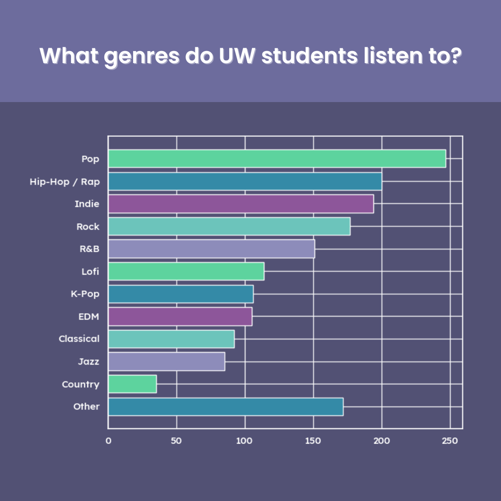
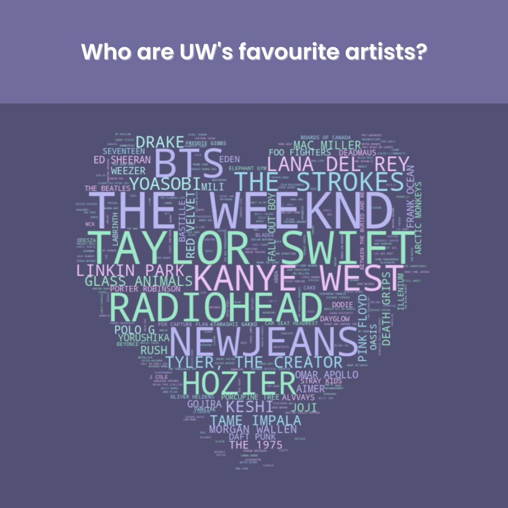
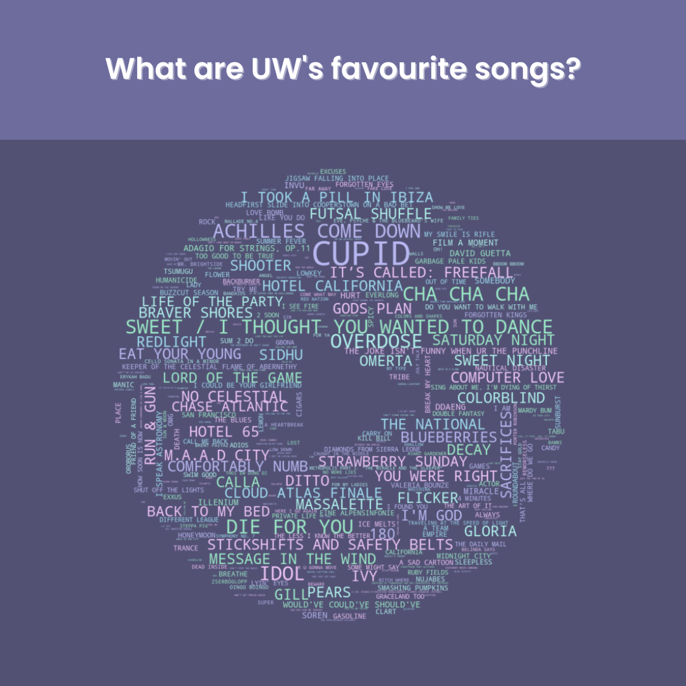
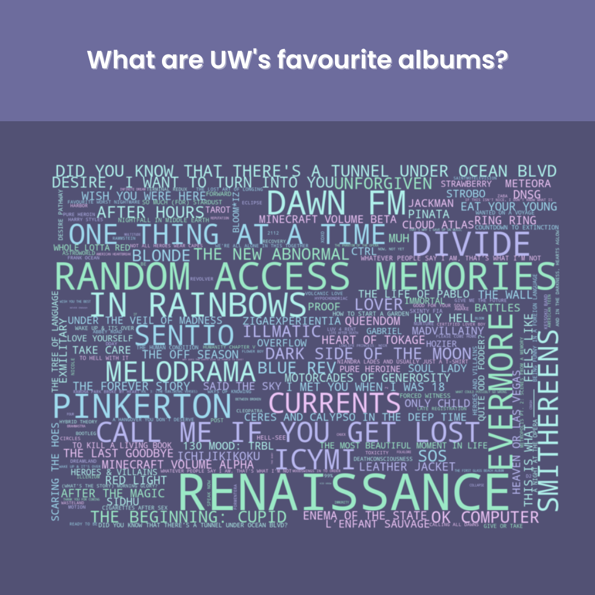
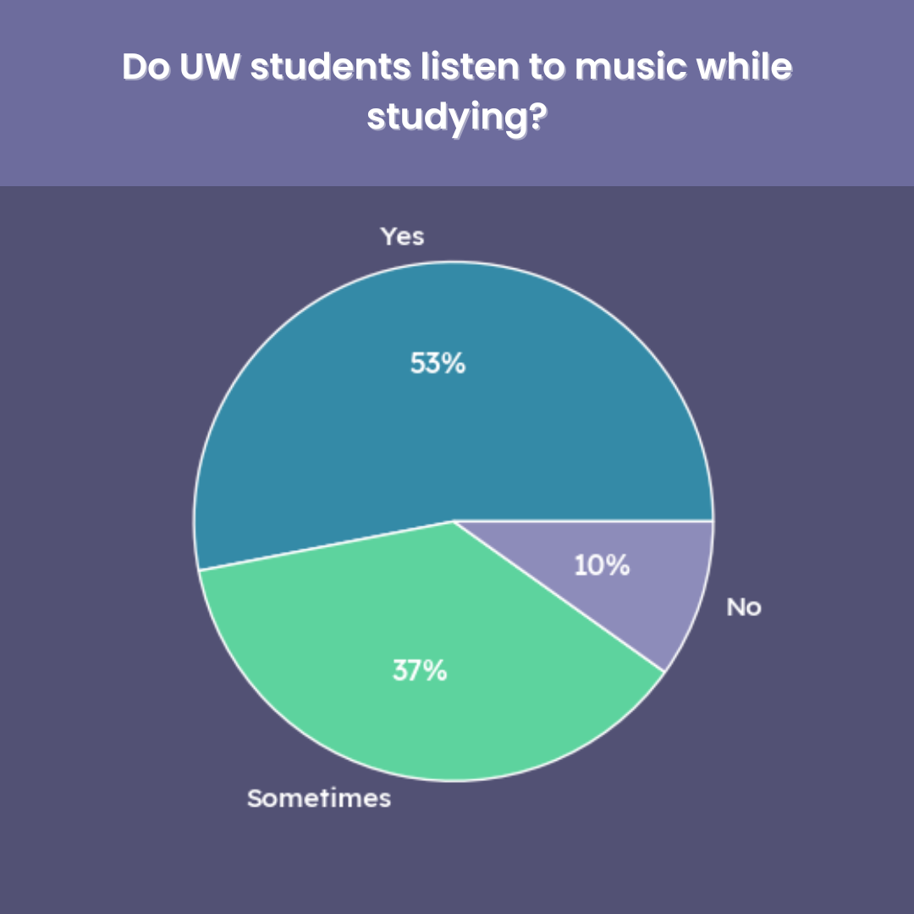

# What Music Do UWaterloo Students Listen To?

An exploratory data analysis (EDA) of the type of music UWaterloo students listen to.

 

## Introduction :cd:

As a huge music nerd, I'm constantly eager to find a new song or artist to listen to and I'm always curious about what plays in the headphones of other people. As an even bigger data and programming nerd, I'm always excited by the possibilities of a new project.

So, as a data visualization post for the University of Waterloo Data Science Club, I couldn't think of anything else better to explore than the relationship between music and the UWaterloo student body!

 

## Tools Used :gear:

<table>
    <tr>
        <td> Languages: </td>
        <td> Python </td>
    </tr>
    <tr>
        <td> Technologies: </td>
        <td> NumPy, Pandas, Matplotlib, Seaborn, WordCloud</td>
    </tr>
</table>
 

## Data Collection :file_folder:

All visualization results come from the data of 400+ survey responses collected in May 2023.

The following link takes you to the survey used to collect the data:
https://forms.gle/dKL9HX8aeQdDRWdw9

The following link takes you to the original reddit post made on May 12, 2023:
https://www.reddit.com/r/uwaterloo/comments/13f6ao1/what_music_do_uw_students_listen_to/?utm_source=share&utm_medium=web2x&context=3

 

## Data Visualizations

<table>
  <tr>
    <td align="center">
      
       
    </td>
    <td align="center">
      
       
    </td>
    <td align="center">
      
       
    </td>
  </tr>
  <tr>
    <td align="center">
      
       
    </td>
    <td align="center">
      
       
    </td>
    <td align="center">
      
       
    </td>
  </tr>
</table>